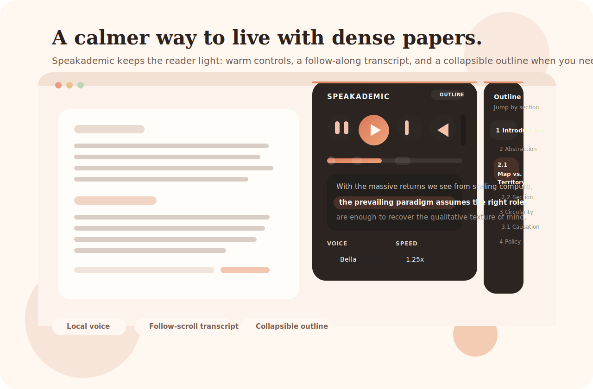
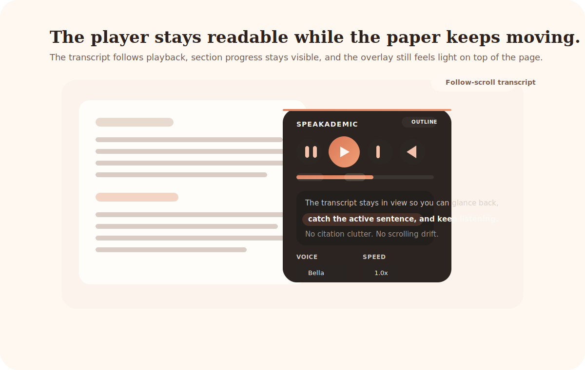
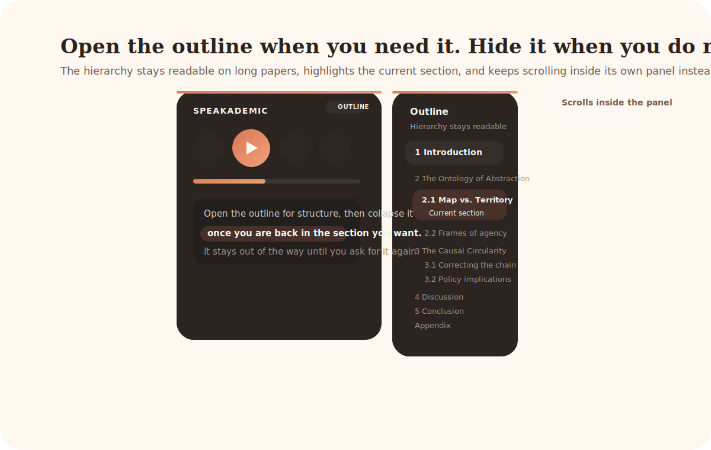

<div align="center">
  

  <h1>Speakademic</h1>

  <p>
    <strong>Turn any paper or article into something you can just listen to.</strong>
  </p>

  <p>
    Speakademic is a Chrome extension that reads academic PDFs and long-form
    articles aloud using a local AI voice. It strips out the noise — citations,
    reference blocks, equation clutter — and gives you a floating player that
    tracks your place, lets you jump between sections, and picks up where you
    left off. Everything runs on your machine. No accounts, no uploads, no cloud.
  </p>
</div>

<p align="center">
  
</p>

> Built for the part of research that happens away from the desk — revisiting
> a methods section on a walk, getting through a dense paper on a late train,
> or giving your eyes a break without losing the thread.

## What makes it good

Most read-aloud tools feel like they were designed for blog posts. Speakademic
was built for people who actually read papers.

- **It cleans before it speaks.** Author-year citation blocks, repeated headers,
  trailing reference lists, long URLs, equation-heavy spans — all stripped or
  softened so listening stays smooth.
- **It works on PDFs and articles.** Same player, same experience, whether
  you're on a PDF or a readable web page.
- **It knows the structure.** Sections are detected automatically, so you can
  skip ahead to Discussion or jump back to Methods without scrubbing.
- **It remembers where you stopped.** Close the tab, come back tomorrow, pick
  up right where you left off.
- **It sounds like a person.** Multiple Kokoro voice profiles, adjustable speed,
  and audio generated entirely on your machine.
- **It stays out of your way.** A floating player on the page — not a separate
  app, not a control panel, not a dashboard.

## Product shots

<table>
  <tr>
    <td width="50%" valign="top">
      
      <br />
      <strong>A player that keeps text clean and in view.</strong><br />
      Follow-scroll playback, citation cleanup, and section-aware progress —
      without turning the page into a dashboard.
    </td>
    <td width="50%" valign="top">
      
      <br />
      <strong>An outline that appears when you need it.</strong><br />
      Jump through long papers in a clean hierarchy, then collapse and go back
      to listening.
    </td>
  </tr>
</table>

## Get it running

You need three things: a Mac, Chrome, and Docker Desktop.

### 1. Start the local voice server

```bash
cd server
./start-server.sh
```

First run downloads the voice model — give it a minute.

### 2. Load the extension

1. Open `chrome://extensions`
2. Turn on **Developer mode**
3. Click **Load unpacked** → select the `extension/` folder
4. For local PDFs, enable **Allow access to file URLs**

### 3. Open something and press play

Open any PDF in Chrome, click the Speakademic icon, and the player appears on
the page. That's it.

## Honest notes

- Works best with text-based PDFs. Scanned documents may need OCR first.
- First launch is slower while the local model warms up.
- For the full walkthrough, see [Setup](docs/SETUP.md) and
  [Troubleshooting](docs/TROUBLESHOOTING.md).

## Repo layout

```
extension/   Chrome extension source
server/      Local Kokoro voice server
docs/        Setup and troubleshooting guides
```
